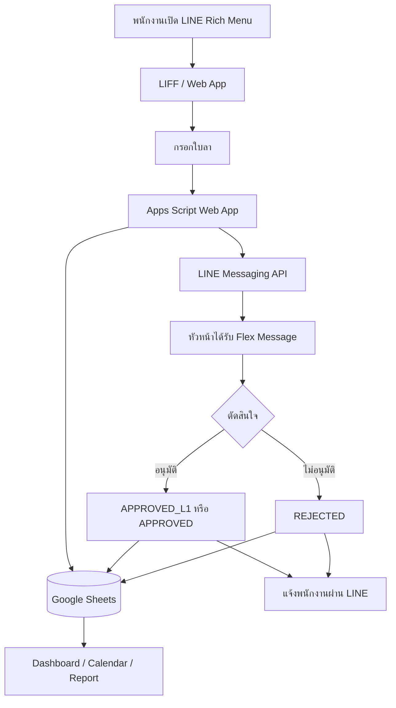

# System Flow

```mermaid
flowchart TD
  A[พนักงานเปิด LINE Rich Menu] --> B[LIFF / Web App]
  B --> C[กรอกใบลา]
  C --> D[Apps Script Web App]
  D --> E[(Google Sheets)]
  D --> F[LINE Messaging API]
  F --> G[หัวหน้าได้รับ Flex Message]
  G --> H{ตัดสินใจ}
  H -->|อนุมัติ| I[APPROVED_L1 หรือ APPROVED]
  H -->|ไม่อนุมัติ| J[REJECTED]
  I --> E
  J --> E
  I --> K[แจ้งพนักงานผ่าน LINE]
  J --> K
  E --> L[Dashboard / Calendar / Report]
```

## การหักยอดวันลา
1. ตอนยื่น: เพิ่ม Pending
2. ตอนผ่านระดับ 1: ยังอยู่ Pending หรือรอ HR
3. ตอนอนุมัติขั้นสุดท้าย: ย้ายจาก Pending ไป Used
4. ตอนปฏิเสธ/ยกเลิก: คืนยอดกลับ Remaining
